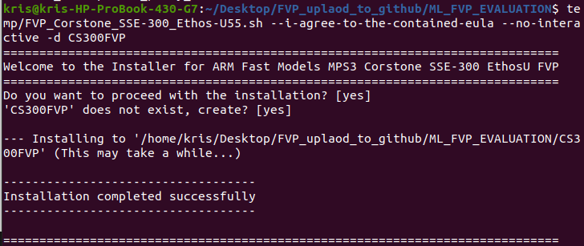
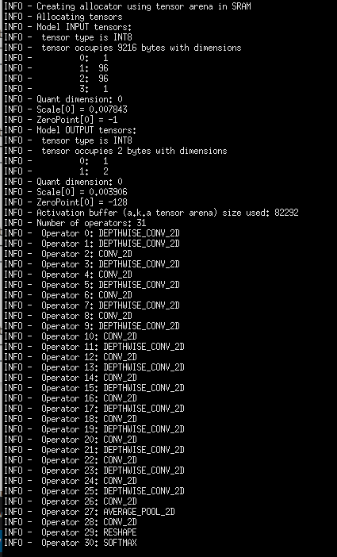
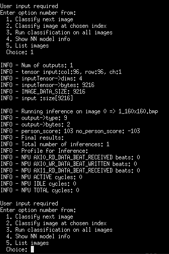
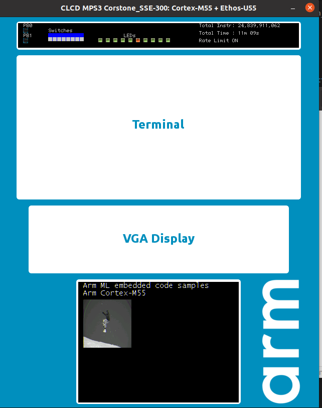
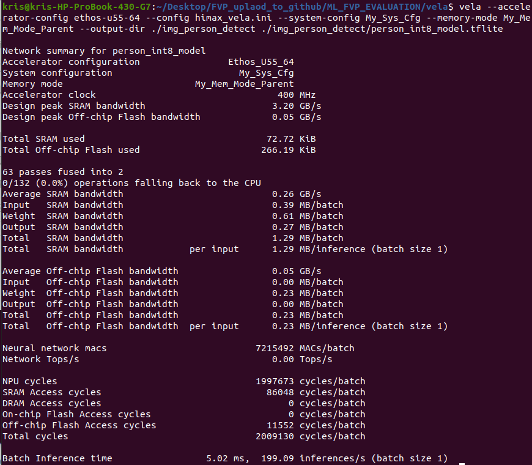
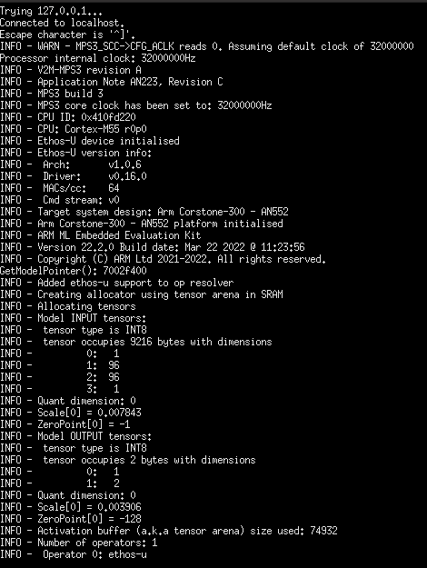
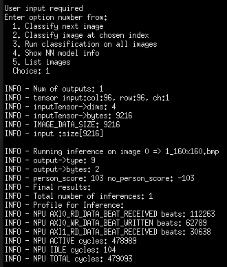
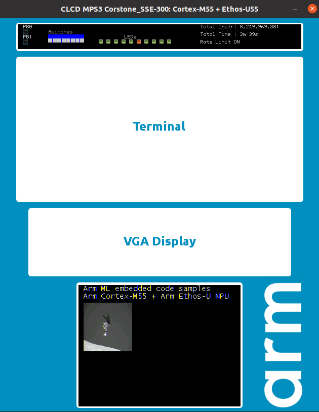

# Person detection example on FVP simulation environment

This repository is for building and deploying example on FVP simulate environment.
To run evaluations using this software, we suggest using Ubuntu 20.04 LTS environment.

## Prerequisites
  - Install the toolkits listed below:
    - Install necessary packages:
      ```
      sudo apt-get update

      sudo apt-get install cmake

      sudo apt-get install curl

      sudo apt install xterm

      sudo apt install python3

      sudo apt install python3.8-venv
      ```
    - Corstone SSE-300 FVP: aligned with the Arm MPS3 development platform and includes both the Cortex-M55 and the Ethos-U55 processors.
      ```
      # Fetch Corstone SSE-300 FVP
      wget https://developer.arm.com/-/media/Arm%20Developer%20Community/Downloads/OSS/FVP/Corstone-300/MPS3/FVP_Corstone_SSE-300_Ethos-U55_11.14_24.tgz
      ```
      
      ```
      # Create folder to be installed
      mkdir CS300FVP
      # Extract the archive
      TEMPDIR=$(mktemp -d)
      tar -C ${TEMPDIR} -xvzf FVP_Corstone_SSE-300_Ethos-U55_11.14_24.tgz
      ```
      
      ```
      # Execute the self-install script
      ${TEMPDIR}/FVP_Corstone_SSE-300_Ethos-U55.sh --i-agree-to-the-contained-eula --no-interactive -d CS300FVP
      ```
      
    - GNU Arm Embedded Toolchain 10-2020-q4-major is the only version supports Cortex-M55.
      ```
      # fetch the arm gcc toolchain.
      wget https://developer.arm.com/-/media/Files/downloads/gnu-rm/10-2020q4/gcc-arm-none-eabi-10-2020-q4-major-x86_64-linux.tar.bz2

      # Extract the archive
      tar -xjf gcc-arm-none-eabi-10-2020-q4-major-x86_64-linux.tar.bz2

      # Add gcc-arm-none-eabi/bin into PATH environment variable.
      export PATH="${PATH}:/[location of your GCC_ARM_NONE_EABI_TOOLCHAIN_ROOT]/gcc-arm-none-eabi/bin"
      ```
    - Arm ML embedded evaluation kit Machine Learning (ML) applications targeted for Arm Cortex-M55 and Arm Ethos-U55 NPU.
      - We use Arm ML embedded evaluation kit to run the Person detection FVP example.
      ```
      # Fetch Arm ML embedded evaluation kit
      git clone https://git.mlplatform.org/ml/ethos-u/ml-embedded-evaluation-kit.git
      cd ml-embedded-evaluation-kit/
      rm -rf ./dependencies
      python3 ./download_dependencies.py
      ./build_default.py
      #go out ml-embedded-evaluation-kit folder and copy person detection resource to ML embedded evaluation kit
      cd ..
      cp -r ./resources/img_person_detect ./ml-embedded-evaluation-kit/resources
      cp -r ./source/use_case/img_person_detect ./ml-embedded-evaluation-kit/source/use_case
      cp -r gen_grey_cpp.py ./ml-embedded-evaluation-kit/scripts/py/
      cp -r ./vela/img_person_detect ./ml-embedded-evaluation-kit/resources_downloaded/
      ```

## Build with Cortex-M55 person detection tflite mdoel without vela
  - Go under folder of ml-embedded-evaluation-kit
    ```
    cd ml-embedded-evaluation-kit
    ```
  - First, you should edit the cmake script, ./scripts/cmake/source_gen_utils.cmake, at the line 32. To make it run with gen_grey_cpp.py to auto convert the grey image to .cc file. 
    ```
    #COMMAND ${PYTHON} ${SCRIPTS_DIR}/py/gen_rgb_cpp.py
    COMMAND ${PYTHON} ${SCRIPTS_DIR}/py/gen_grey_cpp.py
    ```
  - Second, Create the output file and go under the folder
    ```
    mkdir build_img_person_detect && cd build_img_person_detect
    ```
  - Third, Configure the person detection example and set ETHOS_U_NPU_ENABLED to be OFF.And you can run only with Cortex-M55.
    ```
    cmake ../ -DUSE_CASE_BUILD=img_person_detect \-DETHOS_U_NPU_ENABLED=OFF
    ```
  - Finally, Compile the person detection example.
    ```
    make -j4
    ```

## Run with Cortex-M55 person detection tflite mdoel without vela
  - Go out and under the folder of ML_FVP_EVALUATION
  - Run with the commad about
    ```
    CS300FVP/models/Linux64_GCC-6.4/FVP_Corstone_SSE-300_Ethos-U55 ml-embedded-evaluation-kit/build_img_person_detect/bin/ethos-u-img_person_detect.axf
    ```
  - You with see the FVP telnetterminal result below:
   - Start inference: 
      - You will see the input size and tflite op on telnetterminal.
      - 
   - Run inference: 
      - key-in `1` on telnetterminal and you will start to inference first image with only Cortex-M55. You can see the NPU cycle is 0.
      - 
      - And you will see the input image on the screen.

## How to use HIMAX config file to generate vela model
  - Go under vela folder
    ```
    cd vela
    ```
  - Install necessary package:
    ```
    pip install ethos-u-vela
    ```
  - Run vela with himax config ini file with mac=64 and the person detect example tflite model
    ```
    vela --accelerator-config ethos-u55-64 --config himax_vela.ini --system-config My_Sys_Cfg --memory-mode My_Mem_Mode_Parent --output-dir ./img_person_detect ./img_person_detect/person_int8_model.tflite
    ```
  - You will see the vela report on the terminal: 

## Build with Cortex-M55 and Ethos-U55 NPU person detection tflite mdoel
  - Go under folder of ml-embedded-evaluation-kit
    ```
    cd ml-embedded-evaluation-kit
    ```
  - First, you should edit the cmake script, ./scripts/cmake/source_gen_utils.cmake, at the line 32. To make it run with gen_grey_cpp.py to auto convert the grey image to .cc file. 
    ```
    #COMMAND ${PYTHON} ${SCRIPTS_DIR}/py/gen_rgb_cpp.py
    COMMAND ${PYTHON} ${SCRIPTS_DIR}/py/gen_grey_cpp.py
    ```
  - Second, Create the output file and go under the folder
    ```
    mkdir build_img_person_detect_npu && cd build_img_person_detect_npu
    ```

  - Third, Configure the person detection example and set ETHOS_U_NPU_ENABLED to be ON.And you can run with Cortex-M55 and Ethos-U55 NPU.
    ```
    cmake ../ -DUSE_CASE_BUILD=img_person_detect \-DETHOS_U_NPU_ENABLED=ON
    ```
  - Compile the person detection example
    ```
    make -j4
    ```

## Run with Cortex-M55 and Ethos-U55 NPU person detection tflite mdoel
  - Go out and under the folder of ML_FVP_EVALUATION
  - Run with the commad about
    ```
    CS300FVP/models/Linux64_GCC-6.4/FVP_Corstone_SSE-300_Ethos-U55 -C ethosu.num_macs=64 ml-embedded-evaluation-kit/build_img_person_detect_npu/bin/ethos-u-img_person_detect.axf
    ```
    Be careful of the `ethosu.num_macs` number of the MACS at the command. If you use missmatch MACS number with vela model, it will be invoke fail. 
  - You with see the FVP telnetterminal result below:
   - Start inference: 
      - You will see the input size and MACS size on telnetterminal.
      - The tflite op has run with the ethos-u op.
      - 
   - Run inference: 
      - key-in `1` on telnetterminal and you will start to inference first image with Cortex-M55 and Ethos-U55 NPU. 
      - 
      - And you will see the input image on the screen.


## Appendix
  - Add more test image
    - You can add more test image under the file address `ml-embedded-evaluation-kit/resources/img_person_detect/samples`. Configure and compile the person detection example again to test more image.
  - If you want to run the example about the mobilenet image classfication example.
    - Build example with RGB input images. 
      - You should make sure the line 32 and 33 at ./scripts/cmake/source_gen_utils.cmake is run with gen_rgb_cpp.py to auto convert the rgb image to .cc file. 
        ```
        COMMAND ${PYTHON} ${SCRIPTS_DIR}/py/gen_rgb_cpp.py
        #COMMAND ${PYTHON} ${SCRIPTS_DIR}/py/gen_grey_cpp.py
        ```
    - Run inference with vela macs=64 or not
      - You should make sure your `ml-embedded-evaluation-kit/source/use_case/img_class/usecase.cmake` is use the vela model is macs 64 or 128 model at line 50.